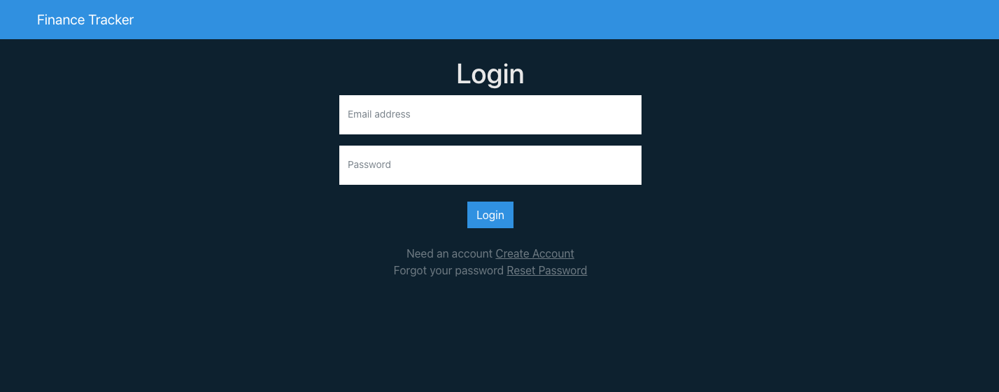
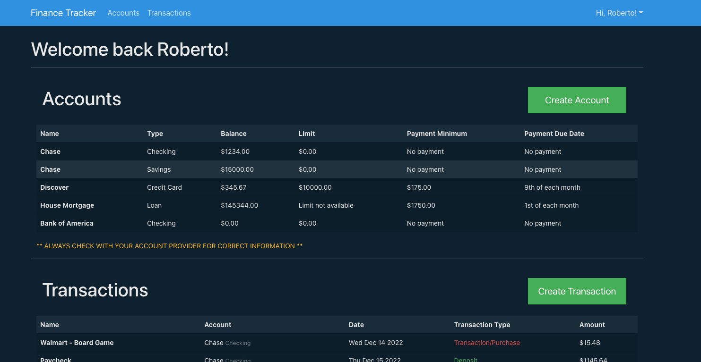
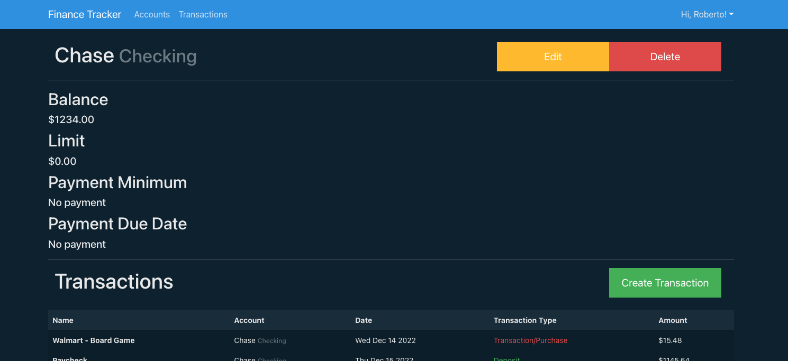

# Finance Tracker

## Last Updated: 12/15/2022

### By: Roberto J Rodriguez

#### [GitHub](https://github.com/robertojrodriguez21) | [LinkedIn](https://www.linkedin.com/in/rob-jes-rod/)

---

### **_Description_**

This application will allow you to keep track of all your finances. You will be able to add an account(Checking, Savings, Credit Cards, and Loans). After you add that account you will be able to add transactions that occurred in that account. On the home page you will see all accounts and balances to each account.

The application will be created with PERN (PostgresSQL, Express, React, Node.js) Stack. It will also be styled with Bootstrap using a template from bootswatch.com.

---

## **_Getting Started_**

### - [Trello Board](https://trello.com/b/rIJwg9G5/finance-tracker)

### - [Deployed Site]() (Coming Soon)

---

## **_Technologies Used_**

- React (Front-End)
  - Bootstrap (Styling)
- PostgresSQL (Back-End)

---

## **_Diagrams_**

## Entity Relationship Diagram

## Component Hierarchy Diagram

---

## **_Project Screenshots_**

## Login Page

## Home Page

## Account Page Example

---

# **_Future Updates_**

## **_Features_**

### In Progress

- [ ] Deploy

### Future

- [ ] DRY my code
- [ ] Allow user to delete all accounts
- [ ] View Transactions by Day, Week, and Month
- [ ] Sort Transactions
- [ ] Add Pagination to Transactions
- [ ] Organize Components Better
- [ ] Allow user to reset password
- [ ] Add different account types
- [ ] Update Diagrams
- [ ] Change button sized for
- [ ] Updated CHD and ERD diagrams

## **_Bugs_**

### In Progress

- [ ] Create profile button needs to be clicked twice after updating email.
  - Wrong email red text is removed but user has to click button again to confirm creation

### Future

- [ ] When user inputs wrong email or password, let user know.
  - Page stays static

## **_Completed Updates_**

- [x] Authentication
- [x] Add profile page
- [x] Allow user to delete profile

---

## **_Credits_**

### - [Bootswatch Template](https://bootswatch.com/superhero/)
